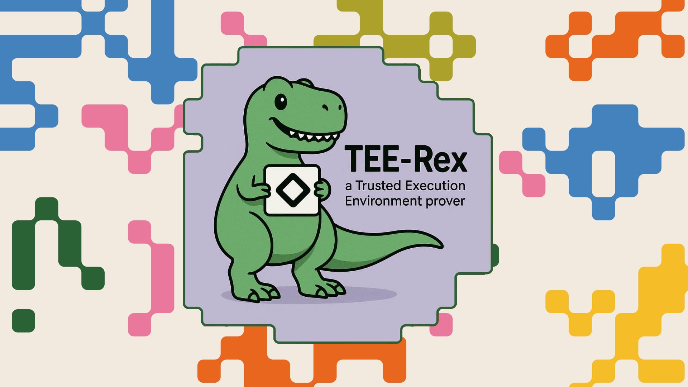

<div align="center">
  

  <h1>TEE-Rex</h1>

  <p>
    <strong>A TEE-based prover for Aztec transactions</strong>
  </p>

  [](https://www.npmjs.com/package/@alejoamiras/tee-rex)
  [](https://github.com/alejoamiras/tee-rex/actions/workflows/sdk.yml)
  [](https://github.com/alejoamiras/tee-rex/actions/workflows/app.yml)
  [](https://github.com/alejoamiras/tee-rex/actions/workflows/server.yml)
  [](https://github.com/alejoamiras/tee-rex/actions/workflows/accelerator.yml)
  [](https://github.com/alejoamiras/tee-rex/actions/workflows/deploy-prod.yml)

  **[nextnet.tee-rex.dev](https://nextnet.tee-rex.dev)** · **[devnet.tee-rex.dev](https://devnet.tee-rex.dev)**
</div>

Prove [Aztec](https://aztec.network) transactions inside an AWS Nitro Enclave. The SDK encrypts proving inputs so that only the enclave can read them, generates the proof inside the TEE, and returns it to the client.

## Features

- Delegate Aztec transaction proving to a TEE (AWS Nitro Enclave)
- Encrypt sensitive data with TEE-attested encryption keys (curve25519 + AES-256-GCM)
- Verify Nitro attestation documents (COSE_Sign1, certificate chain, PCR values)
- Drop-in replacement for Aztec's default prover ([SDK docs](packages/sdk/README.md))
- Seamless fallback to local WASM proving
- Native proving accelerator — bypass WASM throttling with a desktop tray app, auto-fallback on mismatch
- Use the hosted TEE or run your own

## Quick Start

```sh
npm add @alejoamiras/tee-rex
```

```ts
import { createAztecNodeClient } from "@aztec/aztec.js/node";
import { createPXE } from "@aztec/pxe/client/lazy";
import { getPXEConfig } from "@aztec/pxe/config";
import { WASMSimulator } from "@aztec/simulator/client";
import { TeeRexProver } from "@alejoamiras/tee-rex";

const prover = new TeeRexProver("https://nextnet.tee-rex.dev/prover", new WASMSimulator());
const pxe = await createPXE(node, getPXEConfig(), { proverOrOptions: prover });

// use the PXE as usual -- proving is delegated to the TEE
```

See the [SDK README](packages/sdk/README.md) for the full API reference, hosted server URLs, and embedded wallet integration examples.

To run your own TEE-Rex server, see the [Server README](packages/server/README.md).

## Architecture

```
tee-rex/
├── packages/
│   ├── sdk/          → @alejoamiras/tee-rex (npm package)
│   │                   Drop-in Aztec prover: local (WASM), UEE (TEE), or accelerated (native)
│   ├── server/       → Express server (runs in Nitro Enclave or standalone)
│   │                   Handles /prove, /attestation endpoints
│   ├── app/          → Vite frontend demo (local/UEE/TEE mode toggle)
│   └── accelerator/  → Tauri tray app — native proving on localhost:59833
│                       Runs bb binary natively, auto-detected by SDK
├── infra/            → Deploy scripts, IAM policies, CloudFront config
└── docs/             → Architecture diagrams, CI pipeline reference
```

For architecture diagrams and detailed flow descriptions, see [docs/architecture.md](docs/architecture.md).

## Development

```sh
# Install dependencies
bun install

# Run lint + typecheck + unit tests
bun run test

# Run e2e tests (requires Aztec local network + tee-rex server)
bun run test:e2e

# Start the server
bun run start

# Build the SDK
bun run sdk:build
```

See [CONTRIBUTING.md](CONTRIBUTING.md) for development workflow and guidelines.

## Documentation

| Document | Description |
|----------|-------------|
| [SDK README](packages/sdk/README.md) | SDK installation, API reference, usage examples |
| [Server README](packages/server/README.md) | Self-hosting guide, API reference, Docker setup |
| [Accelerator README](packages/accelerator/README.md) | Native proving accelerator — installation, configuration, troubleshooting |
| [Architecture](docs/architecture.md) | System diagrams, proving flow, Docker strategy |
| [CI Pipeline](docs/ci-pipeline.md) | Workflow reference, change detection, deploy logic |

## Contributors

Made with ♥️ by alejo · inspired by [nemi.fi](https://github.com/nemi-fi/tee-rex/)
