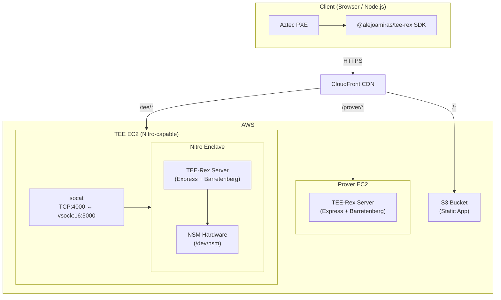
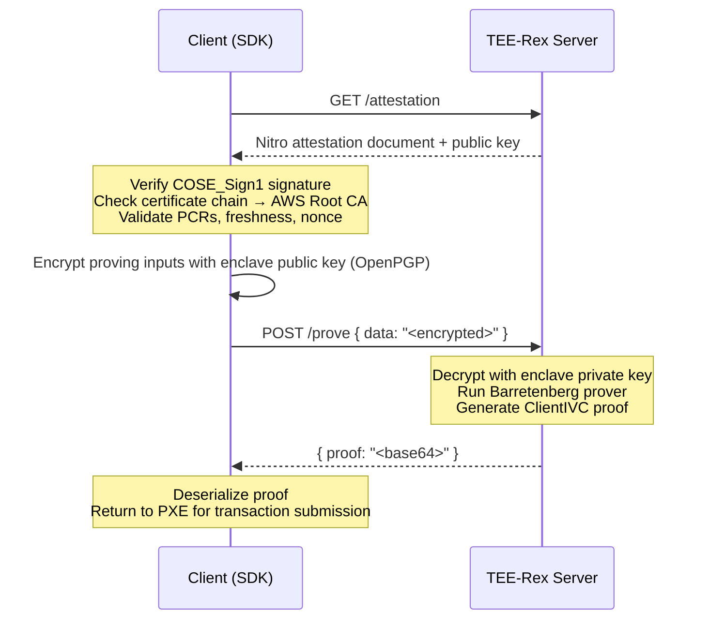
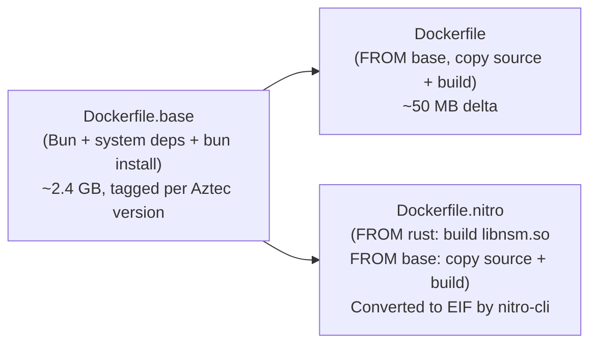

# Architecture

## System Overview

TEE-Rex is a delegated proving service for [Aztec](https://aztec.network/) that runs inside an AWS Nitro Enclave. The SDK encrypts proving inputs so that only the enclave can read them, generates the proof inside the TEE, and returns the public proof to the client.



## Proving Flow



## Package Structure

```
tee-rex/
├── packages/
│   ├── sdk/       → @alejoamiras/tee-rex (npm package)
│   │              Drop-in Aztec prover: local (WASM) or remote (TEE)
│   ├── server/    → Express server (runs in Nitro Enclave or standalone)
│   │              Handles /prove, /attestation, /encryption-public-key
│   └── app/       → Vite frontend demo (local/remote/TEE mode toggle)
├── infra/         → Deploy scripts, IAM policies, CloudFront config
└── docs/          → Architecture, CI pipeline, Nitro deployment guide
```

## Docker Image Strategy



For the full attestation and encryption details, see [How It Works](./how-it-works.md).
