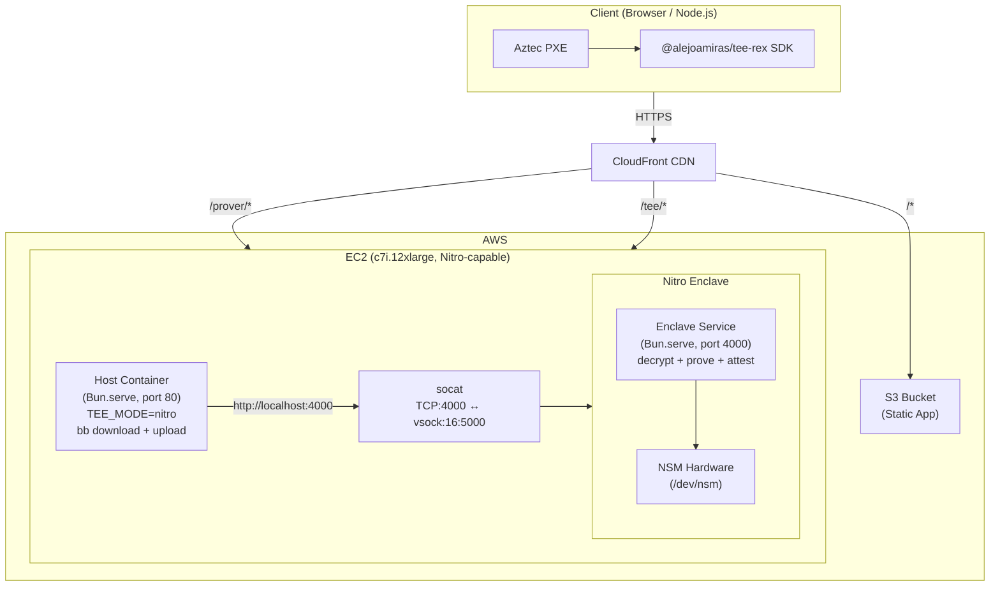
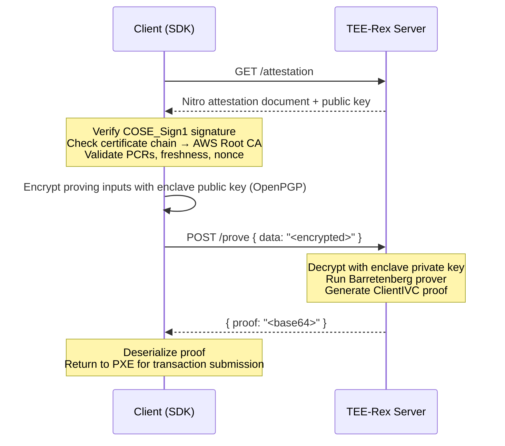
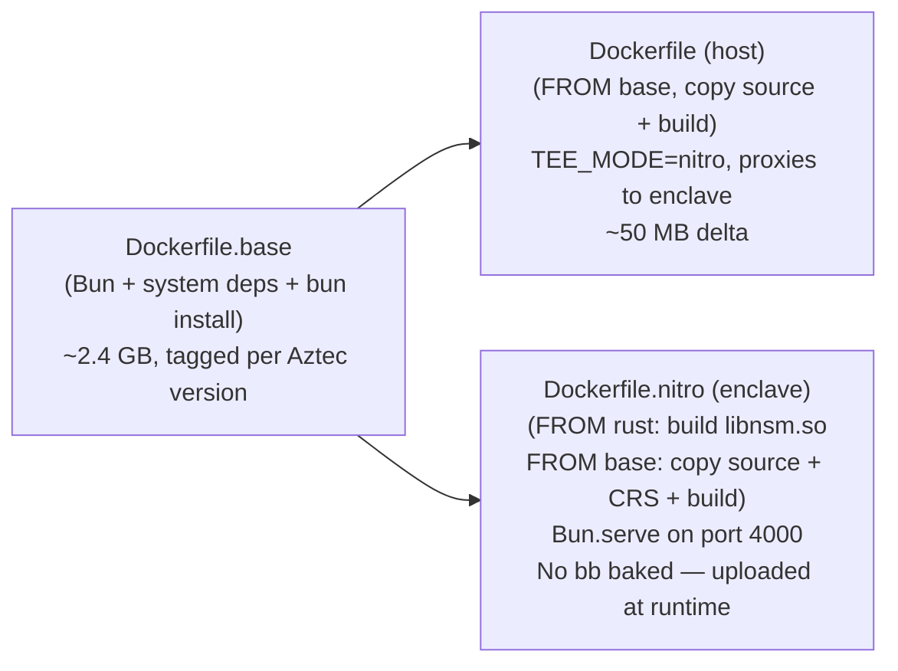

# Architecture

## System Overview

TEE-Rex is a delegated proving service for [Aztec](https://aztec.network/) that runs inside an AWS Nitro Enclave. The SDK encrypts proving inputs so that only the enclave can read them, generates the proof inside the TEE, and returns the public proof to the client.


```mermaid
graph TB
  subgraph Client["Client (Browser / Node.js)"]
    PXE["Aztec PXE"]
    SDK["@alejoamiras/tee-rex SDK"]
    PXE --> SDK
  end

  CF["CloudFront CDN"]

  subgraph AWS["AWS"]
    S3["S3 Bucket<br/>(Static App)"]

    subgraph EC2["EC2 (c7i.12xlarge, Nitro-capable)"]
      Host["Host Container<br/>(Bun.serve, port 80)<br/>TEE_MODE=nitro<br/>bb download + upload"]
      Socat["socat<br/>TCP:4000 ↔ vsock:16:5000"]
      subgraph Enclave["Nitro Enclave"]
        EnclaveServer["Enclave Service<br/>(Bun.serve, port 4000)<br/>decrypt + prove + attest"]
        NSM["NSM Hardware<br/>(/dev/nsm)"]
        EnclaveServer --> NSM
      end
      Host -->|"http://localhost:4000"| Socat
      Socat --> Enclave
    end
  end

  Client -->|"HTTPS"| CF
  CF -->|"/*"| S3
  CF -->|"/prover/*"| EC2
  CF -->|"/tee/*"| EC2
```

## Proving Flow


```mermaid
sequenceDiagram
  participant C as Client (SDK)
  participant S as TEE-Rex Server

  C->>S: GET /attestation
  S-->>C: Nitro attestation document + public key

  Note over C: Verify COSE_Sign1 signature<br/>Check certificate chain → AWS Root CA<br/>Validate PCRs, freshness, nonce

  C->>C: Encrypt proving inputs with enclave public key (OpenPGP)

  C->>S: POST /prove { data: "<encrypted>" }

  Note over S: Decrypt with enclave private key<br/>Run Barretenberg prover<br/>Generate ClientIVC proof

  S-->>C: { proof: "<base64>" }

  Note over C: Deserialize proof<br/>Return to PXE for transaction submission
```

## SDK Phase Lifecycle

The SDK emits phase callbacks during proof generation for UI animation and timing. All modes follow the same pattern, ending with a `"proved"` phase that carries the actual proving duration:

| Phase | Description | Emitted by |
|-------|-------------|------------|
| `serialize` | Serializing witness data (msgpack) | UEE |
| `fetch-attestation` | Fetching enclave attestation document | UEE/TEE |
| `encrypt` | Encrypting payload with enclave public key | UEE/TEE |
| `transmit` | Sending payload to server | UEE |
| `proving` | Proof generation in progress | All modes |
| `proved` | Proof complete — carries `{ durationMs }` | All modes |
| `receive` | Deserializing proof response | All modes |

The `"proved"` phase timing comes from:
- **WASM**: `performance.now()` around the local proof call
- **UEE/TEE**: `x-prove-duration-ms` response header from the server

## Package Structure

```
tee-rex/
├── packages/
│   ├── sdk/          → @alejoamiras/tee-rex (npm package)
│   │                   Drop-in Aztec prover: local (WASM) or UEE/TEE (server)
│   ├── server/       → Two entry points: host (Bun.serve, src/index.ts) + enclave (Bun.serve, src/enclave.ts)
│   │                   Host: /prove, /attestation, /health, /encryption-public-key (proxies to enclave in nitro mode)
│   │                   Enclave: /upload-bb, /prove, /attestation, /public-key, /health
│   ├── app/          → Vite frontend demo (local/UEE/TEE mode toggle)
├── infra/            → Deploy scripts, IAM policies, CloudFront config
└── docs/             → Architecture, CI pipeline, Nitro deployment guide
```

## Docker Image Strategy


```mermaid
graph LR
  Base["Dockerfile.base<br/>(Bun + system deps + bun install)<br/>~2.4 GB, tagged per Aztec version"]
  Host["Dockerfile (host)<br/>(FROM base, copy source + build)<br/>TEE_MODE=nitro, proxies to enclave<br/>~50 MB delta"]
  Nitro["Dockerfile.nitro (enclave)<br/>(FROM rust: build libnsm.so<br/>FROM base: copy source + CRS + build)<br/>Bun.serve on port 4000<br/>No bb baked — uploaded at runtime"]

  Base --> Host
  Base --> Nitro
```

For the full attestation and encryption details, see [How It Works](./how-it-works.md).
