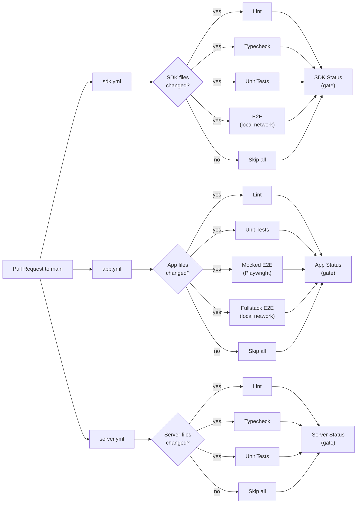
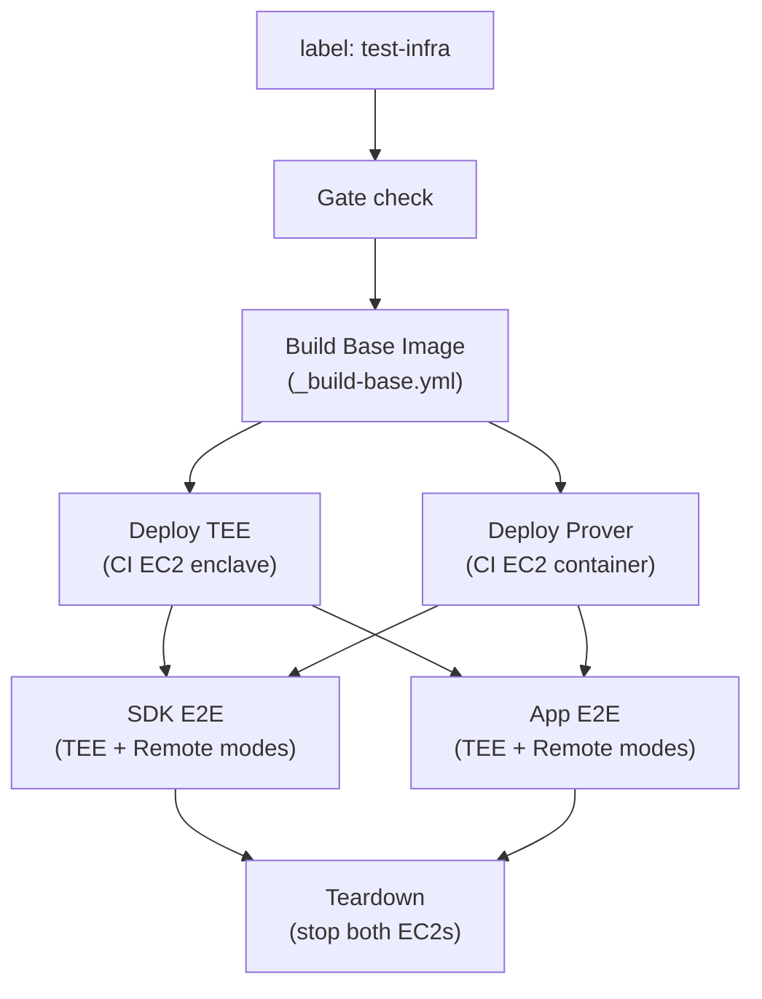
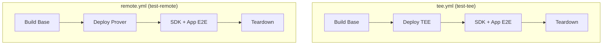
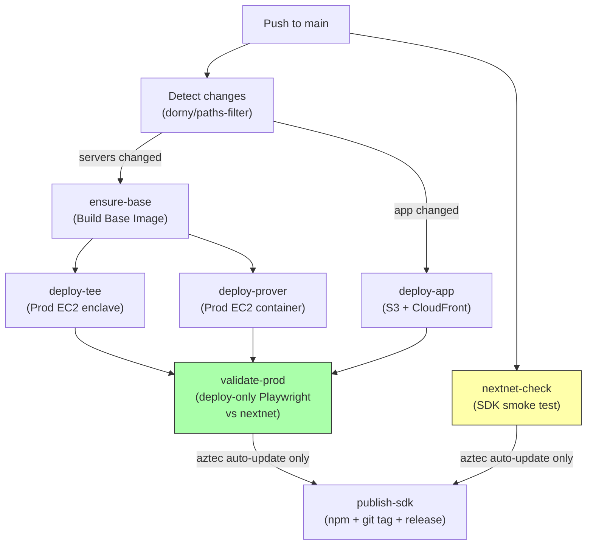
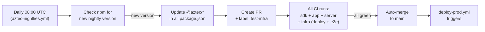

# CI Pipeline

How the tee-rex CI/CD system works. Last updated: 2026-02-20.

---

## Overview

```
16 workflow files total:
  9 main workflows   (sdk, app, server, tee, remote, infra, aztec-nightlies, deploy-prod, deploy-devnet)
  5 reusable         (_build-base, _deploy-tee, _deploy-prover, _publish-sdk, _e2e-sdk, _e2e-app)
  2 composite actions (setup-aztec, start-services)
```

All workflows use **OIDC auth** (no stored AWS keys), **SSM tunnels** (no public EC2 ports), and **ECR registry cache** for Docker builds.

---

## 1. PR Validation

Three independent workflows trigger on every PR to `main`. Each uses [`dorny/paths-filter`](https://github.com/dorny/paths-filter) to detect relevant file changes and skip when nothing changed. A gate job at the end ensures branch protection works regardless of skips.



### Change detection paths

| Workflow | Triggers on changes to |
|----------|----------------------|
| `sdk.yml` | `packages/sdk/**`, `tsconfig.json`, `biome.json`, `package.json`, `bun.lock`, `.github/workflows/sdk.yml`, `.github/workflows/_e2e-sdk.yml`, `.github/actions/**` |
| `app.yml` | `packages/app/**`, `packages/sdk/**`, `tsconfig.json`, `biome.json`, `package.json`, `bun.lock`, `.github/workflows/app.yml`, `.github/workflows/_e2e-app.yml`, `.github/actions/**` |
| `server.yml` | `packages/server/**`, `tsconfig.json`, `biome.json`, `package.json`, `bun.lock`, `.github/workflows/server.yml` |

Note: `app.yml` includes `packages/sdk/**` because the app depends on the SDK. `workflow_dispatch` overrides all filters to `true`.

### Branch protection

Three gate jobs are required for merge: **SDK Status**, **App Status**, **Server Status**. These always run (`if: always()`) and report failure if any upstream job failed or was cancelled, pass if all passed or were skipped.

---

## 2. Infrastructure Testing (Label-Triggered)

Three workflows test server deployments on CI EC2 instances, triggered by PR labels.

### Combined: `infra.yml` (label: `test-infra`)

Used by the aztec-nightlies auto-updater. Deploys both TEE + prover, runs full e2e.



### Individual: `tee.yml` / `remote.yml` (labels: `test-tee` / `test-remote`)

For isolated debugging. Same structure but deploy only one server.



All infra workflows use concurrency groups to cancel in-progress runs when new commits are pushed.

---

## 3. Deploy Production

Triggers on push to `main` (excluding docs, lessons, tests, and Playwright configs). Uses `dorny/paths-filter` to deploy only the components that changed.



### Change detection outputs

| Output | Triggers on | Gates |
|--------|------------|-------|
| `servers` | `packages/server/**`, `packages/sdk/**`, `Dockerfile*`, `infra/**`, `package.json`, `bun.lock` | `ensure-base`, `deploy-tee`, `deploy-prover` |
| `app` | `packages/app/**`, `packages/sdk/**`, `package.json`, `bun.lock` | `deploy-app` |

`workflow_dispatch` overrides both to `true` (deploys everything). `validate-prod` runs when either output is `true`.

### Job details

| Job | What it does | Duration |
|-----|-------------|----------|
| `changes` | `dorny/paths-filter` to detect server vs app changes | ~5s |
| `ensure-base` | Checks ECR for base image, builds + pushes only if missing | ~1-5 min |
| `deploy-tee` | Build Nitro image, push to ECR, start EC2, deploy enclave via SSM | ~25 min |
| `deploy-prover` | Build prover image, push to ECR, start EC2, deploy container via SSM | ~25 min |
| `deploy-app` | Build Vite app with prod URLs, sync to S3, invalidate CloudFront | ~3 min |
| `nextnet-check` | Run SDK connectivity smoke test against nextnet | ~1 min |
| `publish-sdk` | Set version from Aztec dep, `npm publish --provenance`, git tag + GitHub release. Gated by validate-prod + nextnet-check. | ~2 min |
| `validate-prod` | SSM tunnels to prod servers, deploy-only Playwright e2e (`-g "deploys account"`) vs nextnet | ~7 min |

### Conditional behavior

- **Workflow-only changes**: All deploy jobs skip, only `nextnet-check` runs
- **App-only changes**: Only `deploy-app` runs, server deploys skip
- **Server/SDK changes**: Only server deploys run (app also deploys if SDK changed, since it's in both filters)
- **`publish-sdk`**: Only runs when commit message starts with `chore: update @aztec/` (auto-update merges) or on manual dispatch. Gated by `validate-prod` (must pass or be skipped) AND `nextnet-check` (must pass). Can also be triggered standalone via `workflow_dispatch` on `_publish-sdk.yml` for manual retries.
- **`validate-prod`**: Hard gate (no `continue-on-error`). Runs deploy-only tests (`-g "deploys account"`) for faster, more reliable validation. App uses `sendWithRetry` (via `E2E_RETRY_STALE_HEADER`) to handle stale block headers during proving.

---

## 4. Aztec Auto-Update

Daily cron checks for new Aztec nightly versions, creates a PR, and auto-merges when CI passes.



The `test-infra` label triggers `infra.yml` which does a full TEE + prover deployment and e2e on CI instances, ensuring the new Aztec version works end-to-end before merging.

---

## 5. Reusable Workflows

| Workflow | Purpose | Key inputs |
|----------|---------|-----------|
| `_build-base.yml` | Idempotent base image build (Bun + system deps + `bun install`). Checks ECR first, builds only if missing. | None. Outputs: `base_tag` |
| `_deploy-tee.yml` | Build Nitro Docker image, push to ECR, start EC2, deploy enclave via SSM | `environment`, `image_tag`, `base_tag` |
| `_deploy-prover.yml` | Build prover Docker image, push to ECR, start EC2, deploy container via SSM | `environment`, `image_tag`, `base_tag` |
| `_publish-sdk.yml` | Set SDK version from Aztec dep, `npm publish --provenance`, git tag + GitHub release. Supports `workflow_dispatch` for manual retries. | `dist_tag`, `latest` |
| `_e2e-sdk.yml` | Run SDK e2e tests with optional SSM tunnels to TEE/prover | `tee_url`, `prover_url`, `aztec_node_url` |
| `_e2e-app.yml` | Run app Playwright fullstack e2e with optional SSM tunnels | `tee_url`, `prover_url`, `aztec_node_url` |

---

## 6. Composite Actions

### `setup-aztec`

Installs Bun, Foundry, and Aztec CLI (version auto-detected from `packages/sdk/package.json`). Caches Bun deps and Aztec CLI by version. Accepts `skip_cli` input to skip Foundry + CLI when targeting a remote node.

### `start-services`

Starts Aztec local network and tee-rex server in the background, then waits for health checks. Skips local network when `aztec_node_url` points to a remote node. Skips tee-rex server when `prover_url` points to a remote prover. Uploads Aztec logs on failure.

---

## 7. Docker Image Strategy

Two-layer Docker build to maximize layer caching:

```
Dockerfile.base (shared)          ~2.4 GB, tagged base-{aztec-version}
  ├── Bun runtime
  ├── System dependencies
  └── bun install (all workspace deps)

Dockerfile (prover)                ~50 MB delta
  └── FROM base → copy source → build

Dockerfile.nitro (TEE)             ~100 MB delta
  ├── Stage 1: Build NSM library (Rust)
  └── Stage 2: FROM base → copy source + NSM lib → build
```

The base image is built once per Aztec version and cached in ECR. Prover and TEE images extend it with only app-specific code, making rebuilds fast.

### Deploy scripts

- **Prover** (`ci-deploy-prover.sh`): stop container → pull image → run container → prune (container protects image from prune)
- **TEE** (`ci-deploy.sh`): teardown enclave → pull image → build EIF → prune → run enclave (prune must follow EIF build since `nitro-cli` reads image directly, no container)

---

## 8. Key Design Decisions

| Decision | Rationale |
|----------|-----------|
| `dorny/paths-filter` for change detection | Declarative, works for both `push` and `pull_request`, replaces copy-pasted shell scripts |
| Gate job pattern | Branch protection requires specific job names; gate jobs always run and aggregate results |
| `validate-prod` is a hard gate (no `continue-on-error`) | Scoped to deploy-only tests with `sendWithRetry` for reliability. Blocks `publish-sdk` on failure. |
| `workflow_dispatch` overrides all filters | Manual runs should always deploy/test everything |
| ECR registry cache (not GHA cache) | Shared across workflows, no size limits, faster for large Docker images |
| SSM tunnels (no public ports) | EC2 instances have no public IPs; all access is via AWS SSM port forwarding |
| `NPM_TOKEN` for npm publishing | OIDC trusted publishing only supports one workflow per package; `NPM_TOKEN` automation token allows both `deploy-prod.yml` and `deploy-devnet.yml` to publish. AWS still uses OIDC (no stored keys). |
| Separate CI and prod EC2 instances | CI deploys don't affect production; different instance types (CI: `t3.xlarge`, Prod: `m5.xlarge` TEE + `t3.xlarge` prover) |
| Base image split | Avoids re-downloading ~2.4 GB of dependencies on every deploy; only app code changes |
| GHA outputs can't contain secrets | Workflow outputs containing secret values are silently redacted. Pass non-secret identifiers and reconstruct URIs in consumers. |
