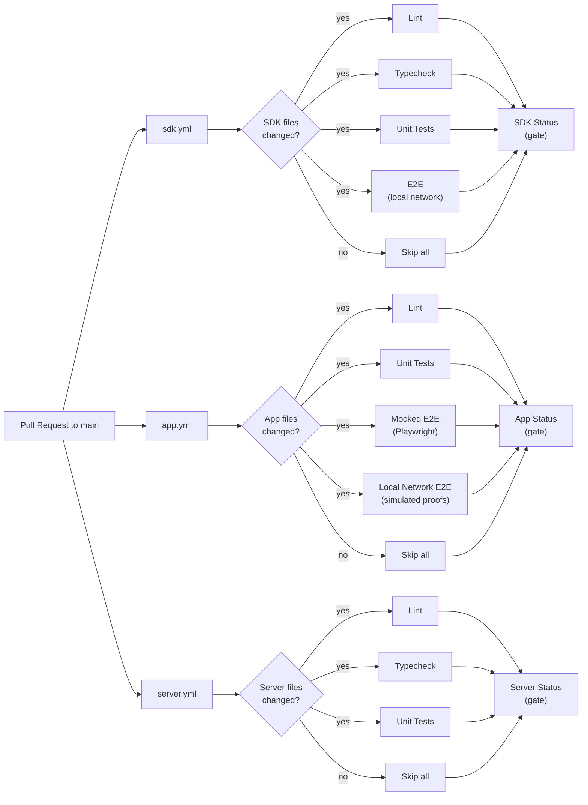
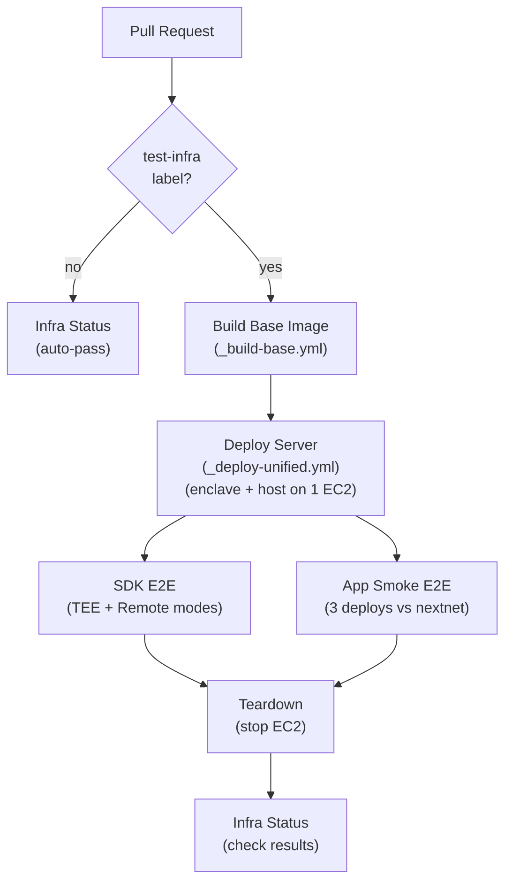
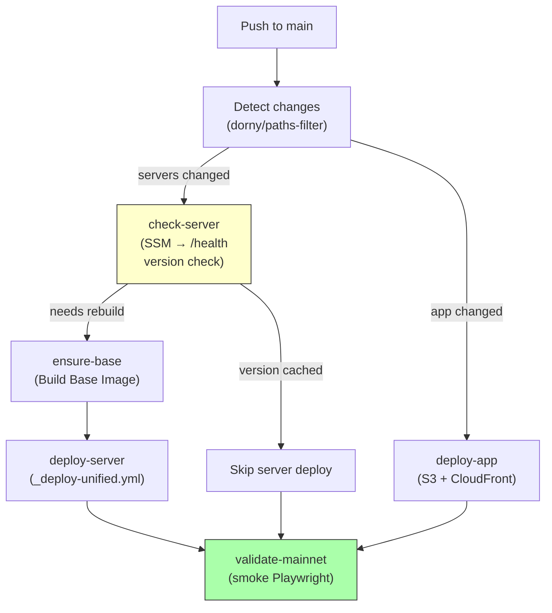
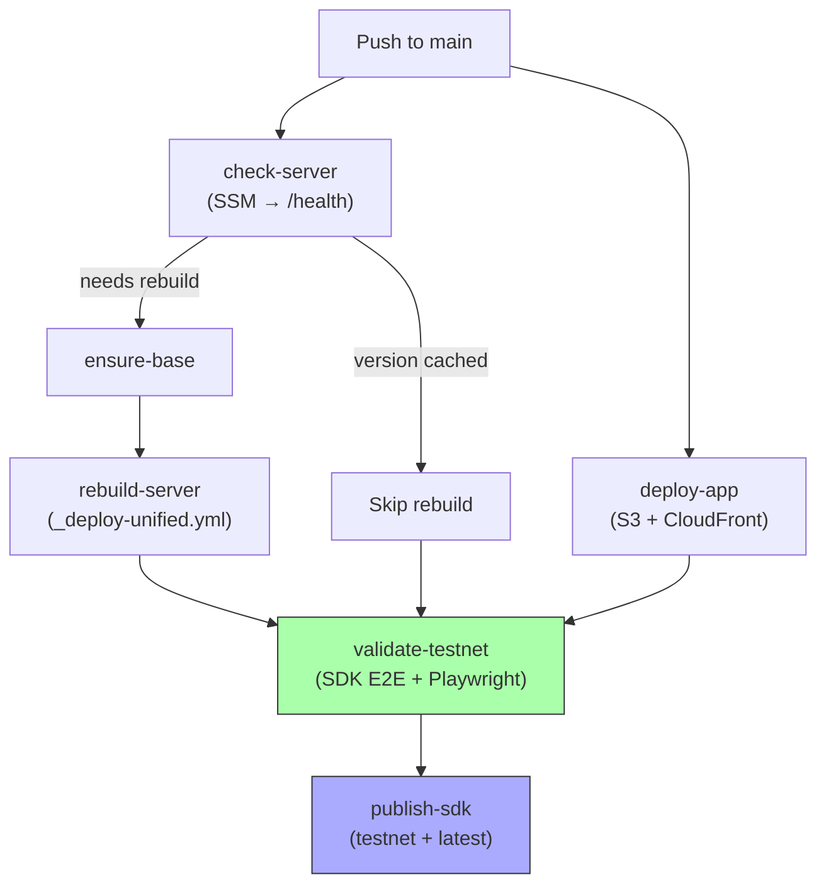
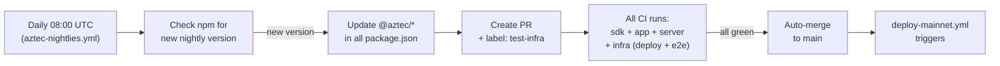

# CI Pipeline

How the tee-rex CI/CD system works. Last updated: 2026-03-17.

---

## Overview

```
16 workflow files total:
  10 main workflows   (sdk, app, server, actionlint, infra, aztec-nightlies, aztec-stable, deploy-mainnet, deploy-testnet, deploy-nightlies)
   6 reusable         (_build-base, _deploy-unified, _publish-sdk, _aztec-update, _e2e-sdk, _e2e-app)
   2 composite actions (setup-aztec, start-services)
```

All workflows use **OIDC auth** (no stored AWS keys), **SSM tunnels** (no public EC2 ports), and **ECR registry cache** for Docker builds.

---

## 1. PR Validation

Three independent workflows trigger on every PR to `main`. Each uses [`dorny/paths-filter`](https://github.com/dorny/paths-filter) to detect relevant file changes and skip when nothing changed. A gate job at the end ensures branch protection works regardless of skips.


```mermaid
graph LR
    PR["Pull Request to main"] --> sdk["sdk.yml"]
    PR --> app["app.yml"]
    PR --> server["server.yml"]

    sdk --> sdk_changes{"SDK files\nchanged?"}
    sdk_changes -->|yes| sdk_lint["Lint"]
    sdk_changes -->|yes| sdk_tc["Typecheck"]
    sdk_changes -->|yes| sdk_unit["Unit Tests"]
    sdk_changes -->|yes| sdk_e2e["E2E\n(local network)"]
    sdk_changes -->|no| sdk_skip["Skip all"]
    sdk_lint & sdk_tc & sdk_unit & sdk_e2e & sdk_skip --> sdk_gate["SDK Status\n(gate)"]

    app --> app_changes{"App files\nchanged?"}
    app_changes -->|yes| app_lint["Lint"]
    app_changes -->|yes| app_unit["Unit Tests"]
    app_changes -->|yes| app_mocked["Mocked E2E\n(Playwright)"]
    app_changes -->|yes| app_local["Local Network E2E\n(simulated proofs)"]
    app_changes -->|no| app_skip["Skip all"]
    app_lint & app_unit & app_mocked & app_local & app_skip --> app_gate["App Status\n(gate)"]

    server --> srv_changes{"Server files\nchanged?"}
    srv_changes -->|yes| srv_lint["Lint"]
    srv_changes -->|yes| srv_tc["Typecheck"]
    srv_changes -->|yes| srv_unit["Unit Tests"]
    srv_changes -->|no| srv_skip["Skip all"]
    srv_lint & srv_tc & srv_unit & srv_skip --> srv_gate["Server Status\n(gate)"]

```

### Change detection paths

| Workflow | Triggers on changes to |
|----------|----------------------|
| `sdk.yml` | `packages/sdk/**`, `tsconfig.json`, `biome.json`, `package.json`, `bun.lock`, `.github/workflows/sdk.yml`, `.github/workflows/_e2e-sdk.yml`, `.github/actions/**` |
| `app.yml` | `packages/app/**`, `packages/sdk/**`, `tsconfig.json`, `biome.json`, `package.json`, `bun.lock`, `.github/workflows/app.yml`, `.github/workflows/_e2e-app.yml`, `.github/actions/**` |
| `server.yml` | `packages/server/**`, `tsconfig.json`, `biome.json`, `package.json`, `bun.lock`, `.github/workflows/server.yml` |

Note: `app.yml` includes `packages/sdk/**` because the app depends on the SDK. `workflow_dispatch` overrides all filters to `true`.

### Branch protection

Four gate jobs are required for merge: **SDK Status**, **App Status**, **Server Status**, **Infra Status**. These always run (`if: always()`) and report failure if any upstream job failed or was cancelled, pass if all passed or were skipped. **Infra Status** auto-passes when the `test-infra` label is absent, ensuring misc PRs aren't blocked by infrastructure tests.

---

## 2. Infrastructure Testing

Three workflows test server deployments on CI EC2 instances.

### Combined: `infra.yml` (label: `test-infra`)

Runs on **all PRs** but only performs deploys/e2e when the `test-infra` label is present (added by the aztec-nightlies auto-updater). The **Infra Status** gate job is a required branch protection check — it auto-passes when the label is absent, and blocks merge on failure when triggered.


```mermaid
graph TD
    PR["Pull Request"] --> check{"test-infra\nlabel?"}
    check -->|no| gate_pass["Infra Status\n(auto-pass)"]
    check -->|yes| base["Build Base Image\n(_build-base.yml)"]
    base --> server["Deploy Server\n(_deploy-unified.yml)\n(enclave + host on 1 EC2)"]
    server --> sdk_e2e["SDK E2E\n(TEE + Remote modes)"]
    server --> app_e2e["App Smoke E2E\n(3 deploys vs nextnet)"]
    sdk_e2e & app_e2e --> teardown["Teardown\n(stop EC2)"]
    teardown --> gate_check["Infra Status\n(check results)"]
```

Infra workflows use concurrency groups to cancel in-progress runs when new commits are pushed.

---

## 3. Deploy Workflows

Three deploy workflows handle the three environments. All share the same EC2 instance and use smart version checking to skip rebuilds.

### `deploy-mainnet.yml` (push to `main`)

Deploys server + app to mainnet. Uses `dorny/paths-filter` to deploy only changed components. Does **not** publish SDK (handled by testnet).


```mermaid
graph TD
    push["Push to main"] --> changes["Detect changes\n(dorny/paths-filter)"]

    changes -->|servers changed| check["check-server\n(SSM → /health\nversion check)"]
    changes -->|app changed| app["deploy-app\n(S3 + CloudFront)"]

    check -->|needs rebuild| base["ensure-base\n(Build Base Image)"]
    check -->|version cached| skip_server["Skip server deploy"]

    base --> server["deploy-server\n(_deploy-unified.yml)"]

    server & app --> validate["validate-mainnet\n(smoke Playwright)"]
    skip_server --> validate

    style validate fill:#afa,stroke:#333
    style check fill:#ffc,stroke:#333
```

### `deploy-testnet.yml` (push to `main`)

Deploys server + app to testnet, validates, then publishes SDK to npm with `testnet` + `latest` tags. This is the primary SDK publishing pipeline.


```mermaid
graph TD
    push["Push to main"] --> check["check-server\n(SSM → /health)"]
    push --> app["deploy-app\n(S3 + CloudFront)"]

    check -->|needs rebuild| base["ensure-base"]
    check -->|version cached| skip["Skip rebuild"]

    base --> server["rebuild-server\n(_deploy-unified.yml)"]

    server & skip --> validate["validate-testnet\n(SDK E2E + Playwright)"]
    app --> validate

    validate --> publish["publish-sdk\n(testnet + latest)"]

    style validate fill:#afa,stroke:#333
    style publish fill:#aaf,stroke:#333
```

### `deploy-nightlies.yml` (push to `nightlies`)

Same pattern but for the nightlies branch. Publishes SDK with `nightlies` tag only (not `latest`).

### Change detection (mainnet only)

| Output | Triggers on | Gates |
|--------|------------|-------|
| `servers` | `packages/server/**`, `Dockerfile*`, `infra/**`, `.github/workflows/_deploy-*/_build-*/deploy-mainnet.yml`, `.github/actions/**`, `package.json`, `bun.lock` | `check-server` |
| `server_code` | `packages/server/**`, `Dockerfile*`, `package.json`, `bun.lock` | Forces rebuild in `check-server` (skips version check) |
| `app` | `packages/app/**`, `packages/sdk/**`, `.github/workflows/deploy-mainnet.yml`, `package.json`, `bun.lock` | `deploy-app` |

`workflow_dispatch` overrides all three to `true` (deploys everything). Testnet and nightlies always run all jobs on push (no path filtering for server).

Note: `packages/sdk/**` was removed from the `servers` filter — the server has zero `@aztec/*` runtime dependencies, so SDK-only changes don't require a server rebuild.

### Shared job details

| Job | What it does | Duration |
|-----|-------------|----------|
| `check-server` | SSM tunnel to prod instance, query `/health` for `available_versions`. Outputs `needs_rebuild=true` when: server code changed, `workflow_dispatch`, server unreachable, or bb version not cached. Skips SSM when force-rebuild is needed. | ~30s-2 min |
| `ensure-base` | Checks ECR for base image, builds + pushes only if missing. Only runs when `needs_rebuild=true`. | ~1-5 min |
| `deploy-server` / `rebuild-server` | Build Nitro + host images in parallel, push to ECR, deploy enclave + host container via SSM (`_deploy-unified.yml`). bb downloaded at runtime. Only when `needs_rebuild=true`. | ~25 min |
| `deploy-app` | Build Vite app with env-specific URLs, sync to S3, invalidate CloudFront | ~3 min |
| `validate-*` | SSM tunnel to host (port 80), SDK E2E + smoke Playwright. Runs even when server deploy is skipped. | ~7-15 min |
| `publish-sdk` | Resolve version (query npm, append `.N` suffix if needed), `npm publish --provenance`, git tag + GitHub release. Testnet sets `latest` tag; nightlies does not. | ~2 min |

### SDK publishing strategy

| Workflow | dist-tag | Sets `latest`? | Trigger |
|----------|----------|---------------|---------|
| `deploy-testnet.yml` | `testnet` | Yes | Push to `main` or manual dispatch |
| `deploy-nightlies.yml` | `nightlies` | No | Push to `nightlies` or manual dispatch |
| `_publish-sdk.yml` | Any | Configurable | Manual `workflow_dispatch` (for retries) |

### Conditional behavior

- **Smart rebuild**: All deploy workflows check `/health` `available_versions` before rebuilding. Skips rebuild when bb version is already cached (~10 min saved).
- **Server code changes**: `check-server` detects `server_code=true` and forces rebuild (no version check)
- **App-only changes** (mainnet): Only `deploy-app` runs, server jobs skip entirely
- **`validate-*`**: Hard gate (no `continue-on-error`). Blocks `publish-sdk` on failure.
- **`publish-sdk`** (testnet): Runs on every push to `main` or manual dispatch. Gated by validation.

---

## 4. Aztec Auto-Update

Automated version bumps for Aztec dependencies, using a shared reusable workflow (`_aztec-update.yml`) that handles check → update → PR creation. Each environment is a thin wrapper with environment-specific config.

### Nightlies → main (`aztec-nightlies.yml`)

Daily cron checks for new Aztec nightly versions, creates a PR targeting `main`, and auto-merges when CI passes.


```mermaid
graph LR
    cron["Daily 08:00 UTC\n(aztec-nightlies.yml)"] --> check["Check npm for\nnew nightly version"]
    check -->|new version| update["Update @aztec/*\nin all package.json"]
    update --> pr["Create PR\n+ label: test-infra"]
    pr --> ci["All CI runs:\nsdk + app + server\n+ infra (deploy + e2e)"]
    ci -->|all green| merge["Auto-merge\nto main"]
    merge --> deploy["deploy-mainnet.yml\ntriggers"]
```

The `test-infra` label triggers `infra.yml` which does a full TEE + prover deployment and e2e on CI instances, ensuring the new Aztec version works end-to-end before merging.

### Shared workflow: `_aztec-update.yml`

The nightlies wrapper calls `_aztec-update.yml` with these inputs:

| Input | Nightlies |
|-------|-----------|
| `dist_tag` | `nightly` |
| `target_branch` | `main` |
| `branch_prefix` | `chore/aztec-nightlies` |
| `add_label` | `test-infra` |
| `auto_merge` | `true` (waits for CI) |

> **Note**: Devnet auto-update (`aztec-devnet.yml`) was deprecated in Phase 35.

---

## 5. Reusable Workflows

| Workflow | Purpose | Key inputs |
|----------|---------|-----------|
| `_build-base.yml` | Idempotent base image build (Bun + system deps + `bun install`). Checks ECR first, builds only if missing. | None. Outputs: `base_tag` |
| `_deploy-unified.yml` | Build Nitro + host images in parallel, push to ECR, start single EC2, deploy enclave + host container via SSM. bb binaries downloaded at runtime and uploaded to enclave. | `environment`, `nitro_image_tag`, `host_image_tag`, `base_tag`, `bb_versions` |
| `_publish-sdk.yml` | Resolve SDK version (queries npm, appends `.N` revision suffix if base already published), set version, `npm publish --provenance`, git tag + GitHub release. When `latest: true`, also sets npm `latest` dist-tag. Supports `workflow_dispatch` for manual retries. | `dist_tag`, `latest` |
| `_aztec-update.yml` | Check npm for new Aztec version, update deps, create/merge PR. Shared by `aztec-nightlies.yml` and `aztec-stable.yml`. | `dist_tag`, `target_branch`, `branch_prefix`, `add_label`, `auto_merge` |
| `_e2e-sdk.yml` | Run SDK e2e tests with optional SSM tunnel to prover/host | `tee_url`, `prover_url`, `aztec_node_url`, `setup_prover_tunnel` |
| `_e2e-app.yml` | Run app Playwright e2e with optional SSM tunnel. Parameterized via `test_script` (default: `test:e2e:smoke`; per-PR uses `test:e2e:local-network`). | `test_script`, `tee_url`, `prover_url`, `aztec_node_url`, `setup_prover_tunnel` |

---

## 6. Composite Actions

### `setup-aztec`

Installs Bun, Foundry, and Aztec CLI (version auto-detected from `packages/sdk/package.json`). Caches Bun deps and Aztec CLI by version. Accepts `skip_cli` input to skip Foundry + CLI when targeting a remote node.

### `start-services`

Starts Aztec local network and tee-rex server in the background, then waits for health checks. Skips local network when `aztec_node_url` points to a remote node. Skips tee-rex server when `prover_url` points to a remote prover. Uploads Aztec logs on failure.

---

## 7. Docker Image Strategy

Two-layer Docker build to maximize layer caching:

```
Dockerfile.base (shared)          ~2.4 GB, tagged base-{aztec-version}
  ├── Bun runtime
  ├── System dependencies
  └── bun install (all workspace deps)

Dockerfile (host)                  ~50 MB delta
  └── FROM base → copy source → build
      (TEE_MODE=nitro, proxies to enclave)

Dockerfile.nitro (enclave)         ~100 MB delta
  ├── Stage 1: Build NSM library (Rust)
  └── Stage 2: FROM base → copy source + NSM lib + CRS → build
      (Bun.serve on port 4000, no bb baked — uploaded at runtime)
```

The base image is built once per Aztec version and cached in ECR. Host and enclave images extend it with only app-specific code, making rebuilds fast. bb binaries are not baked into any Docker image — they're downloaded by the host at deploy time and uploaded to the enclave via `POST /upload-bb`.

### Deploy scripts

- **Unified** (`ci-deploy-unified.sh`): teardown enclave + host → Docker wipe → pull nitro image → build EIF → hugepages → start enclave → health check → download bb binaries → upload to enclave → pull host image → run host container (port 80, `--network host`) → health check. Host proxies to enclave; bb binaries uploaded at runtime (not baked into Docker images).

---

## 8. Key Design Decisions

| Decision | Rationale |
|----------|-----------|
| `dorny/paths-filter` for change detection | Declarative, works for both `push` and `pull_request`, replaces copy-pasted shell scripts |
| Gate job pattern | Branch protection requires specific job names; gate jobs always run and aggregate results |
| `validate-prod` is a hard gate (no `continue-on-error`) | Scoped to smoke tests (3 deploys) with `sendWithRetry` for reliability. Blocks `publish-sdk` on failure. |
| `workflow_dispatch` overrides all filters | Manual runs should always deploy/test everything |
| ECR registry cache (not GHA cache) | Shared across workflows, no size limits, faster for large Docker images |
| SSM tunnels (no public ports) | EC2 instances have no public IPs; all CI access is via AWS SSM port forwarding to port 80 (single tunnel). `TEE_URL = PROVER_URL` since host proxies to enclave. |
| `NPM_TOKEN` for npm publishing | OIDC trusted publishing only supports one workflow per package; `NPM_TOKEN` automation token allows `deploy-testnet.yml` and `deploy-nightlies.yml` to publish. AWS still uses OIDC (no stored keys). |
| Consolidated EC2 (1 per env) | Single c7i.12xlarge runs Nitro enclave (localhost:4000 via socat, not externally accessible) and host container (port 80, `--network host`). All external traffic routes through the host; host proxies to enclave internally. |
| Base image split | Avoids re-downloading ~2.4 GB of dependencies on every deploy; only app code changes |
| GHA outputs can't contain secrets | Workflow outputs containing secret values are silently redacted. Pass non-secret identifiers and reconstruct URIs in consumers. |
| Reusable workflows can't have `concurrency`/`permissions` at workflow level | `workflow_call` workflows inherit or get these from the caller. Put `concurrency` and `permissions` on the calling workflow, not the reusable one — otherwise GitHub reports `startup_failure`. |
| Smart `/health` version check | Deploy workflows SSM tunnel to the running server and check `/health` `available_versions` before rebuilding. Saves ~10 min on deploys where the required bb version is already cached (common after nightly auto-updates). Distinguishes `server_code` changes (always rebuild) from infra-only changes (check first). |
| `api_version` in `/health` | Server returns `api_version: 1` in `/health` response. Enables SDK↔server compatibility checks and fail-fast detection of breaking API changes. |
