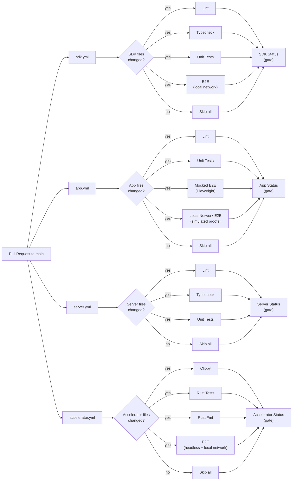
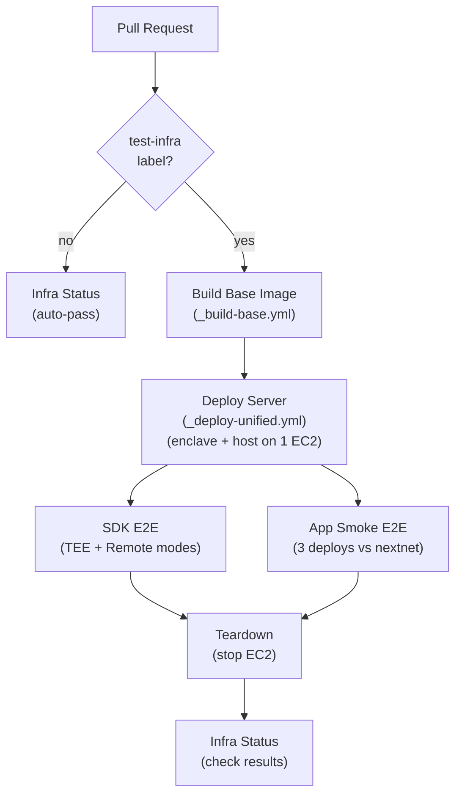
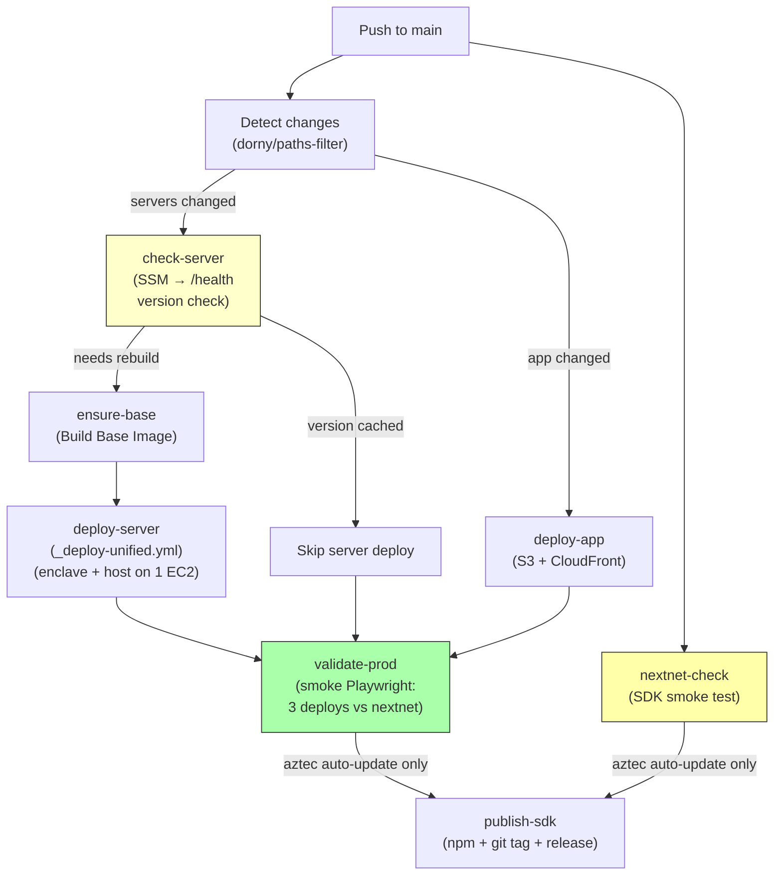
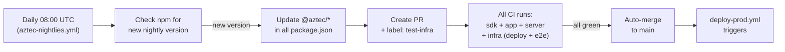
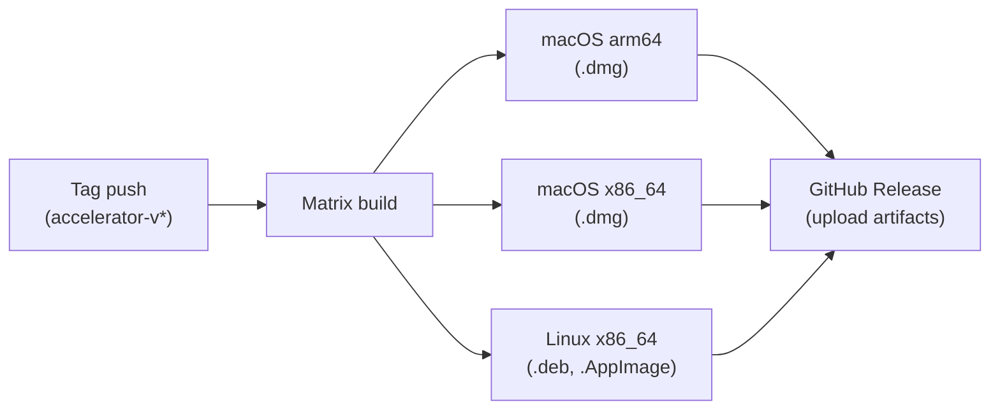

# CI Pipeline

How the tee-rex CI/CD system works. Last updated: 2026-03-12.

---

## Overview

```
14 workflow files total:
   9 main workflows   (sdk, app, server, accelerator, infra, aztec-nightlies, deploy-prod, release-accelerator, release-please-accelerator)
   5 reusable         (_build-base, _deploy-unified, _publish-sdk, _aztec-update, _e2e-sdk, _e2e-app)
   2 composite actions (setup-aztec, start-services)
```

All workflows use **OIDC auth** (no stored AWS keys), **SSM tunnels** (no public EC2 ports), and **ECR registry cache** for Docker builds.

---

## 1. PR Validation

Four independent workflows trigger on every PR to `main`. Each uses [`dorny/paths-filter`](https://github.com/dorny/paths-filter) (or Rust-specific change detection for the accelerator) to detect relevant file changes and skip when nothing changed. A gate job at the end ensures branch protection works regardless of skips.


```mermaid
graph LR
    PR["Pull Request to main"] --> sdk["sdk.yml"]
    PR --> app["app.yml"]
    PR --> server["server.yml"]

    sdk --> sdk_changes{"SDK files\nchanged?"}
    sdk_changes -->|yes| sdk_lint["Lint"]
    sdk_changes -->|yes| sdk_tc["Typecheck"]
    sdk_changes -->|yes| sdk_unit["Unit Tests"]
    sdk_changes -->|yes| sdk_e2e["E2E\n(local network)"]
    sdk_changes -->|no| sdk_skip["Skip all"]
    sdk_lint & sdk_tc & sdk_unit & sdk_e2e & sdk_skip --> sdk_gate["SDK Status\n(gate)"]

    app --> app_changes{"App files\nchanged?"}
    app_changes -->|yes| app_lint["Lint"]
    app_changes -->|yes| app_unit["Unit Tests"]
    app_changes -->|yes| app_mocked["Mocked E2E\n(Playwright)"]
    app_changes -->|yes| app_local["Local Network E2E\n(simulated proofs)"]
    app_changes -->|no| app_skip["Skip all"]
    app_lint & app_unit & app_mocked & app_local & app_skip --> app_gate["App Status\n(gate)"]

    server --> srv_changes{"Server files\nchanged?"}
    srv_changes -->|yes| srv_lint["Lint"]
    srv_changes -->|yes| srv_tc["Typecheck"]
    srv_changes -->|yes| srv_unit["Unit Tests"]
    srv_changes -->|no| srv_skip["Skip all"]
    srv_lint & srv_tc & srv_unit & srv_skip --> srv_gate["Server Status\n(gate)"]

    PR --> accel["accelerator.yml"]
    accel --> accel_changes{"Accelerator files\nchanged?"}
    accel_changes -->|yes| accel_clippy["Clippy"]
    accel_changes -->|yes| accel_test["Rust Tests"]
    accel_changes -->|yes| accel_fmt["Rust Fmt"]
    accel_changes -->|yes| accel_e2e["E2E\n(headless + local network)"]
    accel_changes -->|no| accel_skip["Skip all"]
    accel_clippy & accel_test & accel_fmt & accel_e2e & accel_skip --> accel_gate["Accelerator Status\n(gate)"]
```

### Change detection paths

| Workflow | Triggers on changes to |
|----------|----------------------|
| `sdk.yml` | `packages/sdk/**`, `tsconfig.json`, `biome.json`, `package.json`, `bun.lock`, `.github/workflows/sdk.yml`, `.github/workflows/_e2e-sdk.yml`, `.github/actions/**` |
| `app.yml` | `packages/app/**`, `packages/sdk/**`, `tsconfig.json`, `biome.json`, `package.json`, `bun.lock`, `.github/workflows/app.yml`, `.github/workflows/_e2e-app.yml`, `.github/actions/**` |
| `server.yml` | `packages/server/**`, `tsconfig.json`, `biome.json`, `package.json`, `bun.lock`, `.github/workflows/server.yml` |
| `accelerator.yml` | `packages/accelerator/**`, `.github/workflows/accelerator.yml` |

Note: `app.yml` includes `packages/sdk/**` because the app depends on the SDK. `workflow_dispatch` overrides all filters to `true`.

### Branch protection

Five gate jobs are required for merge: **SDK Status**, **App Status**, **Server Status**, **Accelerator Status**, **Infra Status**. These always run (`if: always()`) and report failure if any upstream job failed or was cancelled, pass if all passed or were skipped. **Infra Status** auto-passes when the `test-infra` label is absent, ensuring misc PRs aren't blocked by infrastructure tests.

---

## 2. Infrastructure Testing

Three workflows test server deployments on CI EC2 instances.

### Combined: `infra.yml` (label: `test-infra`)

Runs on **all PRs** but only performs deploys/e2e when the `test-infra` label is present (added by the aztec-nightlies auto-updater). The **Infra Status** gate job is a required branch protection check — it auto-passes when the label is absent, and blocks merge on failure when triggered.


```mermaid
graph TD
    PR["Pull Request"] --> check{"test-infra\nlabel?"}
    check -->|no| gate_pass["Infra Status\n(auto-pass)"]
    check -->|yes| base["Build Base Image\n(_build-base.yml)"]
    base --> server["Deploy Server\n(_deploy-unified.yml)\n(enclave + host on 1 EC2)"]
    server --> sdk_e2e["SDK E2E\n(TEE + Remote modes)"]
    server --> app_e2e["App Smoke E2E\n(3 deploys vs nextnet)"]
    sdk_e2e & app_e2e --> teardown["Teardown\n(stop EC2)"]
    teardown --> gate_check["Infra Status\n(check results)"]
```

Infra workflows use concurrency groups to cancel in-progress runs when new commits are pushed.

---

## 3. Deploy Production

Triggers on push to `main` (excluding docs, lessons, tests, and Playwright configs). Uses `dorny/paths-filter` to deploy only the components that changed.


```mermaid
graph TD
    push["Push to main"] --> changes["Detect changes\n(dorny/paths-filter)"]

    changes -->|servers changed| check["check-server\n(SSM → /health\nversion check)"]
    changes -->|app changed| app["deploy-app\n(S3 + CloudFront)"]
    push --> nextnet["nextnet-check\n(SDK smoke test)"]

    check -->|needs rebuild| base["ensure-base\n(Build Base Image)"]
    check -->|version cached| skip_server["Skip server deploy"]

    base --> server["deploy-server\n(_deploy-unified.yml)\n(enclave + host on 1 EC2)"]

    server & app --> validate["validate-prod\n(smoke Playwright:\n3 deploys vs nextnet)"]
    skip_server --> validate

    validate & nextnet -->|aztec auto-update only| publish["publish-sdk\n(npm + git tag + release)"]

    style validate fill:#afa,stroke:#333
    style nextnet fill:#ffa,stroke:#333
    style check fill:#ffc,stroke:#333
```

### Change detection outputs

| Output | Triggers on | Gates |
|--------|------------|-------|
| `servers` | `packages/server/**`, `Dockerfile*`, `infra/**`, `.github/workflows/_deploy-*/_build-*/deploy-prod.yml`, `.github/actions/**`, `package.json`, `bun.lock` | `check-server` |
| `server_code` | `packages/server/**`, `Dockerfile*`, `package.json`, `bun.lock` | Forces rebuild in `check-server` (skips version check) |
| `app` | `packages/app/**`, `packages/sdk/**`, `.github/workflows/deploy-prod.yml`, `package.json`, `bun.lock` | `deploy-app` |

`workflow_dispatch` overrides all three to `true` (deploys everything). `validate-prod` runs when either `servers` or `app` is `true`.

Note: `packages/sdk/**` was removed from the `servers` filter — the server has zero `@aztec/*` runtime dependencies, so SDK-only changes don't require a server rebuild.

### Job details

| Job | What it does | Duration |
|-----|-------------|----------|
| `changes` | `dorny/paths-filter` to detect server vs app changes, plus `server_code` subset | ~5s |
| `check-server` | SSM tunnel to prod instance, query `/health` for `available_versions`. Outputs `needs_rebuild=true` when: server code changed, `workflow_dispatch`, server unreachable, or bb version not cached. Skips SSM when force-rebuild is needed. | ~30s–2 min |
| `ensure-base` | Checks ECR for base image, builds + pushes only if missing. Only runs when `needs_rebuild=true`. | ~1-5 min |
| `deploy-server` | Build Nitro + host images in parallel, push to ECR, start single EC2, deploy enclave + host container via SSM (`_deploy-unified.yml`). Host downloads bb from GitHub releases and uploads to enclave at runtime. Only runs when `needs_rebuild=true`. | ~25 min |
| `deploy-app` | Build Vite app with prod URLs, sync to S3, invalidate CloudFront | ~3 min |
| `nextnet-check` | Run SDK connectivity smoke test against nextnet | ~1 min |
| `publish-sdk` | Resolve version (query npm for existing revisions, append `.N` suffix if needed), set SDK version, `npm publish --provenance`, git tag + GitHub release. Gated by validate-prod + nextnet-check. | ~2 min |
| `validate-prod` | SSM tunnels to prod server (both ports on same instance), smoke Playwright e2e (3 deploys: TEE, remote, local) vs nextnet. Runs even when server deploy is skipped (validates existing deployment). | ~7 min |

### Conditional behavior

- **Workflow/infra-only changes** (no server code): `check-server` queries `/health` — if bb version is already cached, skips rebuild entirely (~10 min saved)
- **Server code changes**: `check-server` detects `server_code=true` and forces rebuild (no version check)
- **App-only changes**: Only `deploy-app` runs, server jobs skip entirely
- **SDK-only changes**: Only `deploy-app` runs (SDK is in app filter but not server filter)
- **`publish-sdk`**: Only runs when commit message starts with `chore: update @aztec/` (auto-update merges) or on manual dispatch. Gated by `validate-prod` (must pass or be skipped) AND `nextnet-check` (must pass). Can also be triggered standalone via `workflow_dispatch` on `_publish-sdk.yml` for manual retries.
- **`validate-prod`**: Hard gate (no `continue-on-error`). Runs smoke tests (`--project=smoke`, 3 deploys) for faster, more reliable validation. App uses `sendWithRetry` (via `E2E_RETRY_STALE_HEADER`) to handle stale block headers during proving.

---

## 4. Aztec Auto-Update

Automated version bumps for Aztec dependencies, using a shared reusable workflow (`_aztec-update.yml`) that handles check → update → PR creation. Each environment is a thin wrapper with environment-specific config.

### Nightlies → main (`aztec-nightlies.yml`)

Daily cron checks for new Aztec nightly versions, creates a PR targeting `main`, and auto-merges when CI passes.


```mermaid
graph LR
    cron["Daily 08:00 UTC\n(aztec-nightlies.yml)"] --> check["Check npm for\nnew nightly version"]
    check -->|new version| update["Update @aztec/*\nin all package.json"]
    update --> pr["Create PR\n+ label: test-infra"]
    pr --> ci["All CI runs:\nsdk + app + server\n+ infra (deploy + e2e)"]
    ci -->|all green| merge["Auto-merge\nto main"]
    merge --> deploy["deploy-prod.yml\ntriggers"]
```

The `test-infra` label triggers `infra.yml` which does a full TEE + prover deployment and e2e on CI instances, ensuring the new Aztec version works end-to-end before merging.

### Shared workflow: `_aztec-update.yml`

The nightlies wrapper calls `_aztec-update.yml` with these inputs:

| Input | Nightlies |
|-------|-----------|
| `dist_tag` | `nightly` |
| `target_branch` | `main` |
| `branch_prefix` | `chore/aztec-nightlies` |
| `add_label` | `test-infra` |
| `auto_merge` | `true` (waits for CI) |

> **Note**: Devnet auto-update (`aztec-devnet.yml`) was deprecated in Phase 35.

---

## 5. Accelerator Release

### `release-accelerator.yml`

Tag-triggered workflow that builds and publishes the TeeRex Accelerator to GitHub Releases.


```mermaid
graph LR
    tag["Tag push\n(accelerator-v*)"] --> matrix["Matrix build"]
    matrix --> mac_arm["macOS arm64\n(.dmg)"]
    matrix --> mac_x64["macOS x86_64\n(.dmg)"]
    matrix --> linux["Linux x86_64\n(.deb, .AppImage)"]
    mac_arm & mac_x64 & linux --> release["GitHub Release\n(upload artifacts)"]
```

Trigger: tag push matching `accelerator-v*`. Each matrix job runs `cargo tauri build` with the appropriate target, then uploads the artifacts to the GitHub Release created by the tag.

Note: macOS code signing is deferred (TODO). Windows is not supported (no `bb` binary from Aztec).

### `release-please-accelerator.yml`

Automated version bumping and changelog generation via [release-please](https://github.com/googleapis/release-please-action).

- Trigger: push to `main` with changes in `packages/accelerator/**`
- On push: creates/updates a "Release PR" with version bump in `Cargo.toml` + `tauri.conf.json` + CHANGELOG
- When Release PR is merged: creates a git tag `accelerator-v{version}` which triggers `release-accelerator.yml`
- Uses `PAT_TOKEN` (not `GITHUB_TOKEN`) so tag pushes trigger other workflows
- Config: `release-please-config.json` (Rust release type, `accelerator-v` tag prefix, RC prerelease)
- Manifest: `.release-please-manifest.json` (tracks current version)

---

## 6. Reusable Workflows

| Workflow | Purpose | Key inputs |
|----------|---------|-----------|
| `_build-base.yml` | Idempotent base image build (Bun + system deps + `bun install`). Checks ECR first, builds only if missing. | None. Outputs: `base_tag` |
| `_deploy-unified.yml` | Build Nitro + host images in parallel, push to ECR, start single EC2, deploy enclave + host container via SSM. bb binaries downloaded at runtime and uploaded to enclave. | `environment`, `nitro_image_tag`, `host_image_tag`, `base_tag`, `bb_versions` |
| `_publish-sdk.yml` | Resolve SDK version (queries npm, appends `.N` revision suffix if base already published), set version, `npm publish --provenance`, git tag + GitHub release. Supports `workflow_dispatch` for manual retries. | `dist_tag`, `latest` |
| `_aztec-update.yml` | Check npm for new Aztec version, update deps, create/merge PR. Shared by `aztec-nightlies.yml` and `aztec-devnet.yml`. | `dist_tag`, `target_branch`, `branch_prefix`, `add_label`, `auto_merge` |
| `_e2e-sdk.yml` | Run SDK e2e tests with optional SSM tunnels to TEE/prover | `tee_url`, `prover_url`, `aztec_node_url` |
| `_e2e-app.yml` | Run app Playwright e2e with optional SSM tunnels. Parameterized via `test_script` (default: `test:e2e:smoke`; per-PR uses `test:e2e:local-network`). | `test_script`, `tee_url`, `prover_url`, `aztec_node_url` |

---

## 7. Composite Actions

### `setup-aztec`

Installs Bun, Foundry, and Aztec CLI (version auto-detected from `packages/sdk/package.json`). Caches Bun deps and Aztec CLI by version. Accepts `skip_cli` input to skip Foundry + CLI when targeting a remote node.

### `start-services`

Starts Aztec local network and tee-rex server in the background, then waits for health checks. Skips local network when `aztec_node_url` points to a remote node. Skips tee-rex server when `prover_url` points to a remote prover. Uploads Aztec logs on failure.

---

## 8. Docker Image Strategy

Two-layer Docker build to maximize layer caching:

```
Dockerfile.base (shared)          ~2.4 GB, tagged base-{aztec-version}
  ├── Bun runtime
  ├── System dependencies
  └── bun install (all workspace deps)

Dockerfile (host)                  ~50 MB delta
  └── FROM base → copy source → build
      (TEE_MODE=nitro, proxies to enclave)

Dockerfile.nitro (enclave)         ~100 MB delta
  ├── Stage 1: Build NSM library (Rust)
  └── Stage 2: FROM base → copy source + NSM lib + CRS → build
      (Bun.serve on port 4000, no bb baked — uploaded at runtime)
```

The base image is built once per Aztec version and cached in ECR. Host and enclave images extend it with only app-specific code, making rebuilds fast. bb binaries are not baked into any Docker image — they're downloaded by the host at deploy time and uploaded to the enclave via `POST /upload-bb`.

### Deploy scripts

- **Unified** (`ci-deploy-unified.sh`): teardown enclave + host → Docker wipe → pull nitro image → build EIF → hugepages → start enclave → health check → download bb binaries → upload to enclave → pull host image → run host container (port 80, `--network host`) → health check. Host proxies to enclave; bb binaries uploaded at runtime (not baked into Docker images).

---

## 9. Key Design Decisions

| Decision | Rationale |
|----------|-----------|
| `dorny/paths-filter` for change detection | Declarative, works for both `push` and `pull_request`, replaces copy-pasted shell scripts |
| Gate job pattern | Branch protection requires specific job names; gate jobs always run and aggregate results |
| `validate-prod` is a hard gate (no `continue-on-error`) | Scoped to smoke tests (3 deploys) with `sendWithRetry` for reliability. Blocks `publish-sdk` on failure. |
| `workflow_dispatch` overrides all filters | Manual runs should always deploy/test everything |
| ECR registry cache (not GHA cache) | Shared across workflows, no size limits, faster for large Docker images |
| SSM tunnels (no public ports) | EC2 instances have no public IPs; all access is via AWS SSM port forwarding |
| `NPM_TOKEN` for npm publishing | OIDC trusted publishing only supports one workflow per package; `NPM_TOKEN` automation token allows publishing from multiple workflows. AWS still uses OIDC (no stored keys). |
| Consolidated EC2 (1 per env) | Single c7i.12xlarge runs both Nitro enclave (port 4000) and host container (port 80, `--network host`). Host proxies to enclave and manages bb version lifecycle. |
| Base image split | Avoids re-downloading ~2.4 GB of dependencies on every deploy; only app code changes |
| GHA outputs can't contain secrets | Workflow outputs containing secret values are silently redacted. Pass non-secret identifiers and reconstruct URIs in consumers. |
| Reusable workflows can't have `concurrency`/`permissions` at workflow level | `workflow_call` workflows inherit or get these from the caller. Put `concurrency` and `permissions` on the calling workflow, not the reusable one — otherwise GitHub reports `startup_failure`. |
| Smart `/health` version check | Both `deploy-prod.yml` and `deploy-devnet.yml` SSM tunnel to the running server and check `/health` `available_versions` before rebuilding. Saves ~10 min on deploys where the required bb version is already cached (common after nightly auto-updates). `deploy-prod.yml` distinguishes `server_code` changes (always rebuild) from infra-only changes (check first). |
| `api_version` in `/health` | Server returns `api_version: 1` in `/health` response. Enables SDK↔server compatibility checks and fail-fast detection of breaking API changes. |
