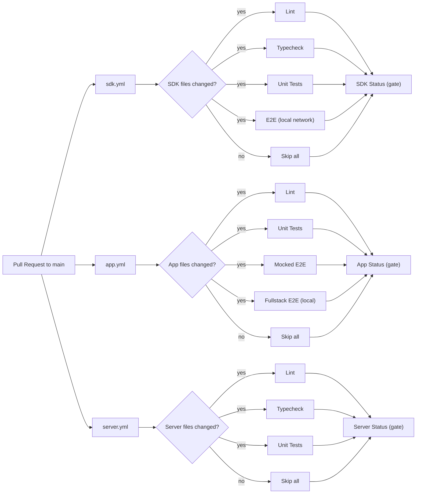
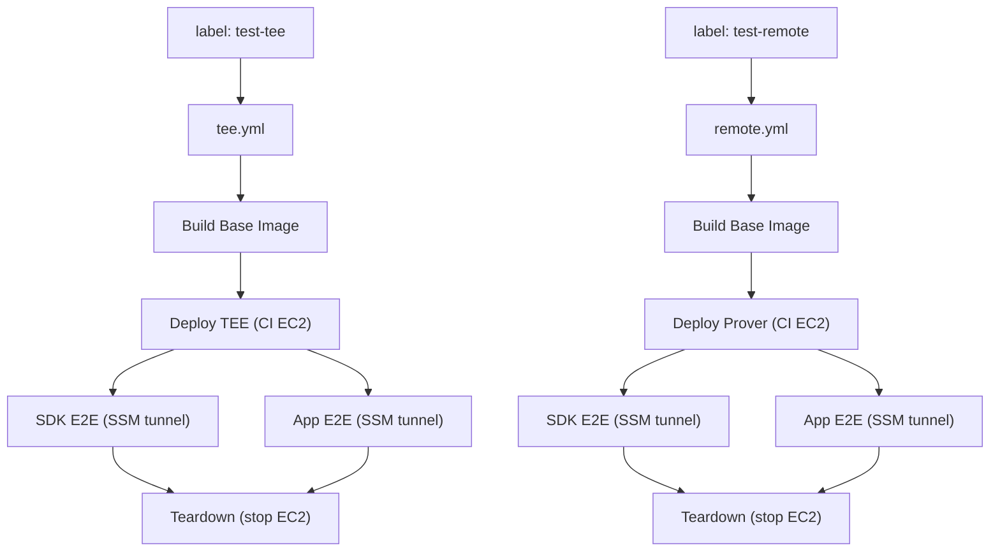
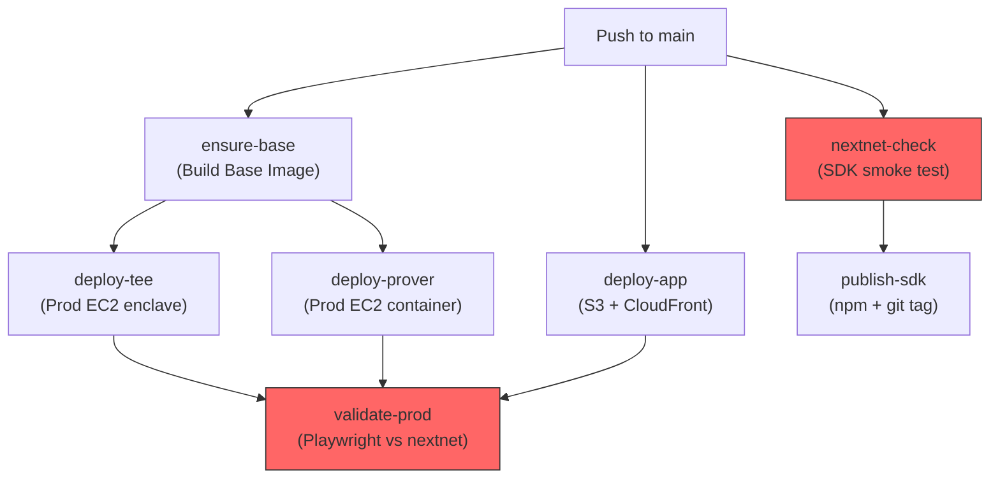
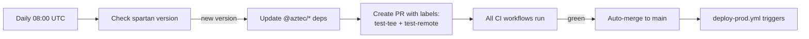

# CI Pipeline Audit

**Date**: 2026-02-16
**Trigger**: 5 consecutive `deploy-prod` failures on main after Phase 20B merge

---

## 1. Pipeline Architecture

### PR Validation (per-package)

Three independent workflows trigger on PRs to `main`. Each detects relevant file changes and skips if nothing changed.



### Label-Triggered Workflows (TEE + Remote)

Added to PRs (manually or by aztec-spartan auto-updater) to test deployed infrastructure.



### Deploy Production (push to main)



### Aztec Auto-Update



---

## 2. Current Failure Analysis

### Root Cause: Nextnet Dependency

**All 5 consecutive failures** on main share the same root cause: `nextnet.aztec-labs.com` is unreachable. Two jobs depend on it:

| Job | Failure Mode | Impact |
|-----|-------------|--------|
| `nextnet-check` | `e2e-setup.ts` preload throws before any test runs | Blocks `publish-sdk` (acceptable) but also marks workflow as failed |
| `validate-prod` | `fullstack.fixture.ts` throws in `assertServicesAvailable()` | Cannot verify prod deployment works |

**The irony**: The nextnet smoke test (`nextnet.test.ts`) is designed to check connectivity, but it never gets to run because the preload (`e2e-setup.ts`) throws first.

### Failure Chain

```
e2e-setup.ts preload
  → assertServicesAvailable()
    → fetch("https://nextnet.aztec-labs.com/status") → timeout/error
      → aztecOk = false
        → throw Error("Required services not available (aztec: false, tee-rex: true)")
          → bun test exits with code 1
            → nextnet-check job FAILS
              → publish-sdk SKIPPED
              → deploy-prod workflow marked FAILED
```

### Why the Preload is Wrong for Nextnet

The preload was designed for local e2e tests where services must be running before tests start. But when `AZTEC_NODE_URL` points to nextnet:

1. The preload checks a **remote** service it has no control over
2. If that service is down, **all tests fail** — not just connectivity tests
3. The `nextnet.test.ts` file has its own `describe.skipIf(isLocalNetwork)` which handles the local/remote distinction
4. The preload makes the test suite fragile to external outages

---

## 3. Assessment by Pillar

### Reliability

| Area | Rating | Notes |
|------|--------|-------|
| PR validation | Good | Gate job pattern is solid, change detection works well |
| Deploy pipeline | Fragile | Deploys succeed but workflow shows as failed due to nextnet dependency |
| Auto-update | Good | Labels + auto-merge works well when CI is green |
| Nextnet tests | Broken | Preload prevents tests from running; should be the test's job to handle |

**Key issue**: deploy-prod has no separation between "deploy succeeded" and "validation passed". A nextnet outage makes the entire pipeline look broken even though TEE, prover, and app all deployed successfully.

### Correctness

| Area | Rating | Notes |
|------|--------|-------|
| Test isolation | Good | Per-package test suites, separate mocked/fullstack projects |
| Service checks | Mixed | Local service checks are correct; remote/nextnet checks are too aggressive |
| Error messages | Poor | When tests fail against nextnet, the error says "Start Aztec local network" — misleading |
| validate-prod scope | Fixed | PR #50 correctly scoped to `demo.fullstack.spec.ts` only |

### Efficiency

| Area | Rating | Notes |
|------|--------|-------|
| Docker caching | Good | ECR registry cache + base image split (Phase 20B) |
| Change detection | Good | Only runs jobs for changed packages |
| Parallel execution | Good | deploy-tee, deploy-prover, deploy-app run in parallel |
| Wasted work | Minor | `nextnet-check` installs all deps just to fail on a connectivity check |

### Observability

| Area | Rating | Notes |
|------|--------|-------|
| Deploy logs | Good | SSM command output captured, Aztec logs uploaded on failure |
| Test failures | Improved | PR #50 added browser console capture |
| Error attribution | Poor | Pipeline fails but doesn't distinguish "nextnet is down" from "our code is broken" |

---

## 4. Proposed Improvements

### Immediate Fix: Make Nextnet Tests Resilient

**Problem**: `e2e-setup.ts` preload throws when aztec node is unreachable + non-local.

**Fix**: When targeting a non-local network, skip the aztec reachability check in the preload. The test files themselves (`nextnet.test.ts`, `fullstack.fixture.ts`) already handle their own service checks.

```
Before: preload always checks → throws → all tests die
After:  preload checks only for local network → nextnet.test.ts handles its own connectivity
```

### Immediate Fix: deploy-prod Structure

**Problem**: `validate-prod` failure marks entire workflow as failed even though deploys succeeded.

**Fix**: Add `continue-on-error: true` to `validate-prod` since it depends on an external network we don't control. Deploys succeed independently; validation is best-effort.

**Note**: `nextnet-check` is intentionally left as a hard failure because it gates `publish-sdk`. With `continue-on-error`, `needs.nextnet-check.result` would return `'success'` even on failure, which would incorrectly allow publishing when nextnet is down. The workflow will still show a red X when nextnet is down, but `publish-sdk` correctly won't run.

### Future: Separate Deploy Status from Validation Status

Right now there's no way for a human looking at the workflow run to distinguish:
- "Deploys succeeded, nextnet is down" (not our problem)
- "Deploy failed" (our problem)

Consider adding a final `deploy-status` gate job that only checks deploy jobs, separate from validation.

---

## 5. Files to Change

| File | Change | Why |
|------|--------|-----|
| `packages/sdk/e2e/e2e-setup.ts` | Skip Aztec reachability check when not local network | Preload kills tests when nextnet is down |
| `packages/app/e2e/fullstack.fixture.ts` | Context-aware error messages (local vs remote) | Error said "Start local network" even when targeting nextnet |
| `.github/workflows/deploy-prod.yml` | Add `continue-on-error: true` to `validate-prod` | External service outage shouldn't mark deploy as failed |
